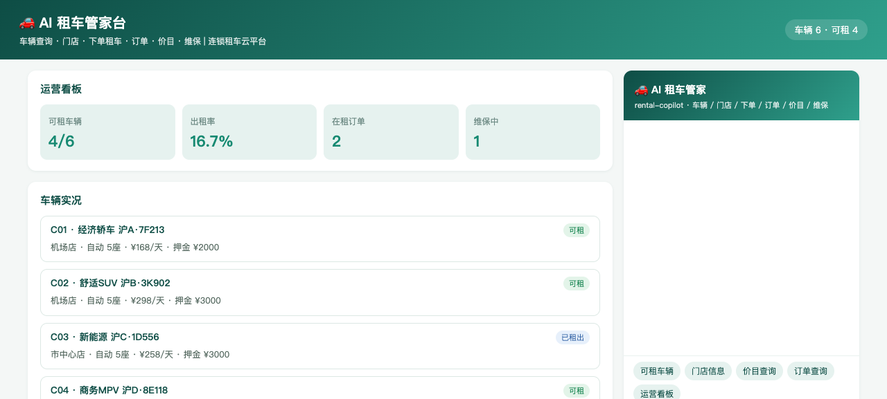
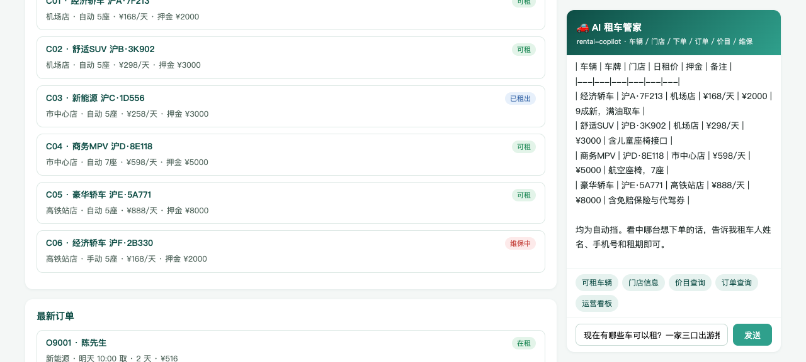
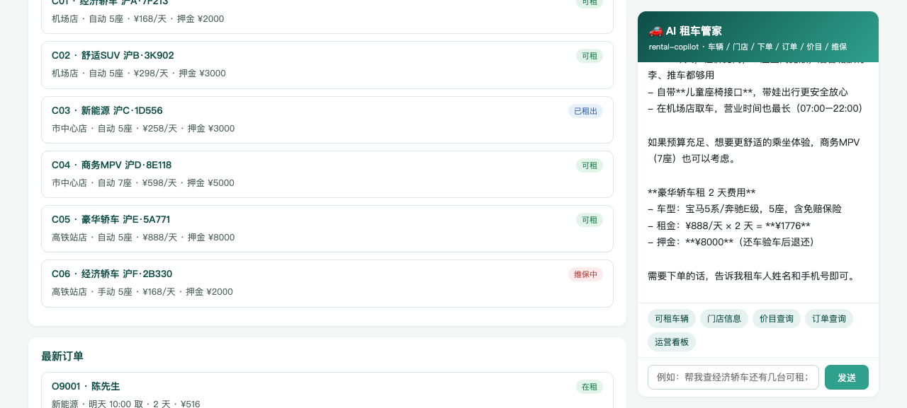
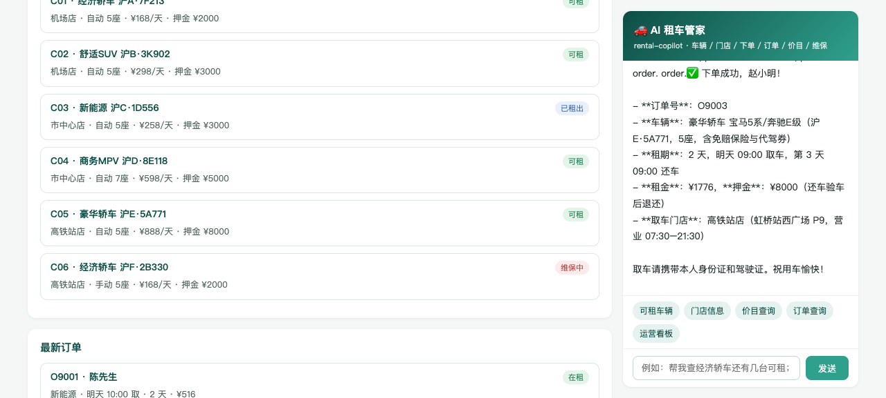

# 🚗 Car Rental · AI 租车管家（DSH Java Native Plugin 场景案例 P65）

> 基于 [deepseek-harness-java（DSH）](https://github.com/deepseek-harness-java) Java Native Plugin 机制构建的连锁租车智能管家：车辆查询、门店导航、下单租车、订单跟踪、价目咨询、维保一览、运营统计，一个 Agent 全搞定。

  

## ✨ 功能总览

| 工具 | 说明 | 对应 REST |
|------|------|-----------|
| `car_list` | 车辆列表（按门店/状态过滤，可租/已租出/维保中） | `GET /api/cars` |
| `store_list` | 门店列表（地址/营业时间/可租数） | `GET /api/stores` |
| `rent` | 下单租车（仅"可租"可下单，报订单号/租金/押金） | `POST /api/rent` |
| `order_info` | 订单查询（车辆/取还车时间/金额/状态） | `GET /api/order?orderId=` |
| `price` | 车型价目（日租价/押金/说明） | `GET /api/price?model=` |
| `maintenance` | 维保一览（项目/预计恢复时间） | `GET /api/maintenance` |
| `stats` | 运营看板（出租率/在租订单/调度建议） | `GET /api/stats` |

## 🖼 界面预览

### 运营看板


### 可租车辆 + AI 推荐


### 价目查询


### 下单租车


## 🏗 架构

```
用户 ⇄ p-app (Spring Boot :18104, SSE 代理)
           │  POST /api/assistant/stream → DSH /api/agent/stream (agentId=rental-copilot)
           ▼
   DSH Harness (:8090, standalone, H2)
           │  plugin__rental-copilot__<tool>
           ▼
   p-plugin (CarRentalPlugin, JAVA_NATIVE in-process)
           │  HTTP
           ▼
   p-app REST API（7 个业务端点）
```

- **p-app**：租车业务系统（内存数据：6 台车 C01–C06、3 家门店、2 个在租订单、5 档车型价目），并内置 AI 对话页（SSE 流式）。
- **p-plugin**：`AbstractHarnessPlugin` 实现，注册 7 个 `AbstractTool` + 系统提示词（下单前复述要素、保险条款只转述）+ `PRE_TOOL_USE` 钩子。

## 🚀 快速开始

### 1. 启动 DSH（standalone 模式，本地 H2 无需外部 MySQL）

```bash
java -Dspring.profiles.active=standalone -Dserver.port=8090 -jar deepseek-harness-java-app.jar
```

在 DSH 控制台配置模型（baseUrl + apiKey）。

### 2. 构建并安装插件

```bash
mvn clean package -DskipTests
# 通过 DSH 控制台或 /api/harness/plugins/install 上传 p-plugin/target/p-plugin-1.0.0-SNAPSHOT.jar
# 激活：POST /api/harness/plugins/activate {"pluginId":"rental-copilot"}
```

### 3. 启动业务应用

```bash
java -Dserver.port=18104 -jar p-app/target/p-app-1.0.0-SNAPSHOT.jar
```

打开 <http://127.0.0.1:18104> 即可使用。

### 4. 命令行验证（SSE 流式）

```bash
curl -N -X POST http://127.0.0.1:8090/api/agent/stream \
  -H 'Content-Type: application/json' \
  -d '{"agentId":"rental-copilot","message":"现在有哪些车可以租？"}'
```

## 📁 项目结构

```
car-rental/
├── p-app/       # 租车业务 + AI 前台（Spring Boot, :18104）
│   └── src/main/java/cn/xiaofuge/f/app/
│       ├── CarRentalApplication.java  # 启动类
│       ├── RController.java           # 7 个 REST 端点
│       ├── RStore.java                # 业务数据与规则（可租校验/押金/统计）
│       └── AssistantController.java   # SSE 代理到 DSH
├── p-plugin/    # DSH Java Native 插件
│   └── src/main/java/cn/xiaofuge/f/plugin/
│       └── CarRentalPlugin.java       # 7 工具 + 系统提示词 + 钩子
└── docs/images/ # 截图
```

## 📖 更多

详细使用说明见 [docs/使用说明.md](docs/使用说明.md)。

## License

MIT
